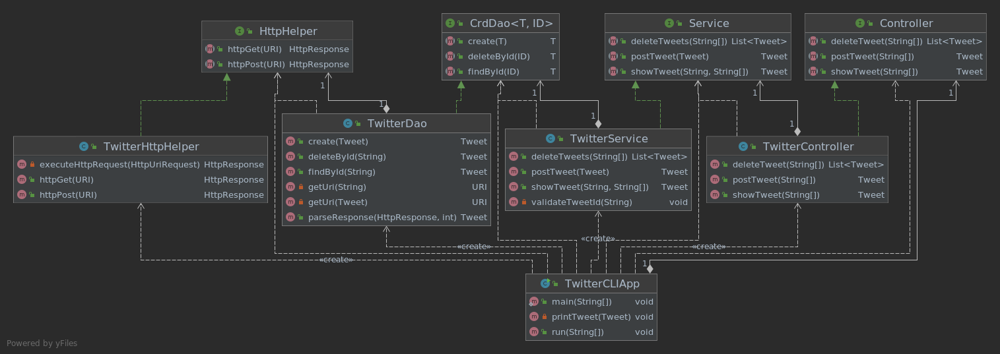

# Introduction 
The Java Twitter app allows users to interact with the twitter's REST API to create, post and search tweets through the command line. It communicates with the Twitter server via HTTP requests send using `Apache httpclient` and `OAuth 1.0` for request authentication. Structurally, this project follows MVC architecture and utilizes seperate DAO, service and DTO layers to seperate different program logic. `Jackson` library was used for object serialization and deserialization. This program is integration tested aswell as unit tested using `Junit` and `Mockito`. In addition, `Maven` and `Spring` are used to manage and simply various dependecies and `Docker` was used for deployment.

# Quick Start 
A Twitter Developer account with consumer key, consumer secret, access token and token secret 
is necessary for this app to be functioning. 

Maven: 
```
mvn clean package -DskipTests
``` 

Run via Jar File:

```
java -jar path/to/jar/file post|show|delete [other params]
```
Run via Docker: 
```
docker run --rm \ -e consumerKey=YOUR_VALUE \
    -e consumerSecret=YOUR_VALUE \
    -e accessToken=YOUR_VALUE \
    -e tokenSecret=YOUR_VALUE \
dorjee/twitter post|show|delete [options]
```

# Design 


### TwitterCLIApp
This class declares and instantiates all the components of the app and calls the run method which is responsible for parsing the arguments. It interacts directly with the Controller layer.

### Controller 
This layer consumes user input via command line argument, and calls the corresponding service layer method. No bussiness logic is implemented in this layer.

### Service
This layer handles all the business logic of the app. For instance it validates various business constraints such as character limit, coordinate boundries and data types. Once it satisfies the parameters, it calls the DAO layer to interact with the persistance layer via Twitter REST API. 


### DAO
This layer is responsible is responsible for isolating the service layer with the persistance layer. The TwitterDAO works together with the TwitterHttpHelper class to generate request to the server (Twitter API) and parse the response into Tweet objects.

### HttpHelper 
This is a helper class used for authenticating and executing HTTP requests. 

## Models
Models are implemented using Plain Old Java Objects (POJOs) which is a class with private member variables and
public getters and setters. This class encapsulates Tweet data which often displays in JSON format.
* Coordinates 
* Entities
* Hashtag
* Tweet
* UserMention

### Sample Tweet Model
```
{
   "created_at":"Mon Feb 18 21:24:39 +0000 2019",
   "id":1097607853932564480,
   "id_str":"1097607853932564480",
   "text":"test with loc223",
   "entities":{
      "hashtags":[],      
      "user_mentions":[]  
   },
   "coordinates":null,    
   "retweet_count":0,
   "favorite_count":0,
   "favorited":false,
   "retweeted":false
}
```

## Spring
Traditonally for projects that manages dependencies via Dependency Injection enable loosely coupled classes. However, it lacks scalibility as projects grow larger it becomes harder and more error-prone to manage these dependencies manually. Spring is used in this project to manage all dependencies automatically.

# Test
All modules and methods have been integration tested aswell as unit testd using both JUnit 4 and Mochito 

## Deployment 
This application is contanerized using docker and deployed to DockerHub. 

# Improvements 
- Create the full version of the tweet object to perform more complex operations 
- More sophiticated queries 

